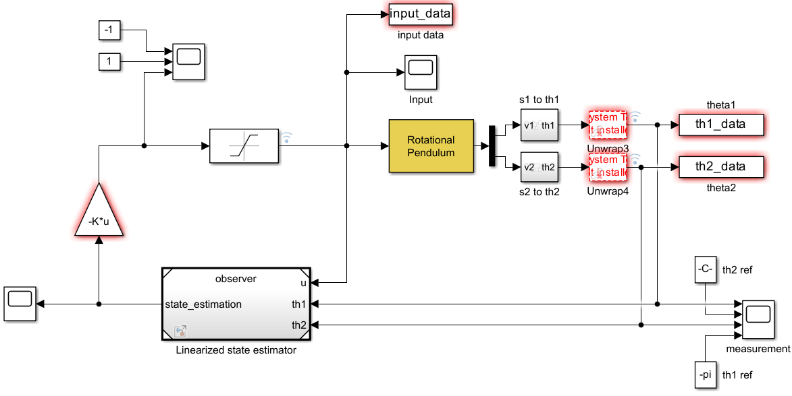
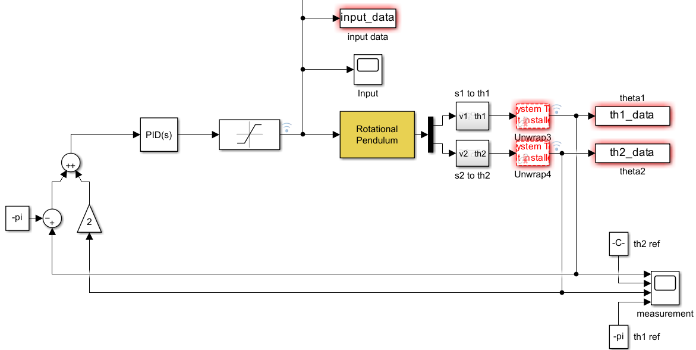

# Double-pendulum

This repository has been created for the project of the course "Control Systems Lab" with <a href="https://scholar.google.com/citations?user=LMKnHkgAAAAJ&hl=en">Prof. Riccardo Ferrari</a> in BA4. The purpose of the project is to control a double pendulum by stabilizing it in 2 equilibrium positions and rejecting the input disturbance. 

## [Control desciption](Project_brief/Control_Systems_Lab_report.pdf)

### White Box model
The first step is to create a model of the real system using the right parameters. This involves calibrating the model through a Non-Linear Least-Square Optimization process. This helps in comparing and adjusting the model's output data to match the data collected from the real pendulum.

### Equilibrium points
The 2 equilibrium positions chosen are up-up and down-down. This implies using a linear controller for both positions.

#### Up-Up Position
For this position, the chosen layout for the controller is a LQR (to simplify pole placement) coupled with a Luenberg observer (in order to reconstruct the full state). The design of the controller ended up with the following weights:  

$$Q=\begin{bmatrix}
10 & 0 & 0 & 0 & 0 \\
0 & 20 & 0 & 0 & 0 \\
0 & 0 & 200 & 0 & 0 \\
0 & 0 & 0 & 110 & 0 \\
0 & 0 & 0 & 0 & 10 \\
\end{bmatrix}, R=350$$

    
    

#### Down-Down Position
This position aims to reject input disturbances. The design has been achieved by implementing two cascaded PID controllers in series to individually regulate the two variables of the SIMO sytem. The best parameters found so far are listed below: 

$$ P=1, I=0, D=-0.4$$

    
      

